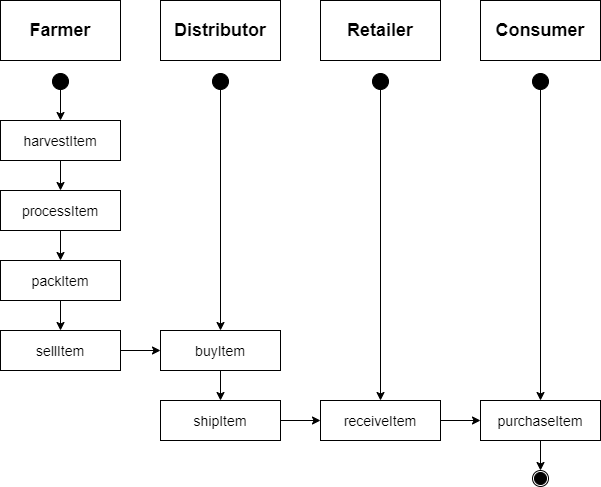
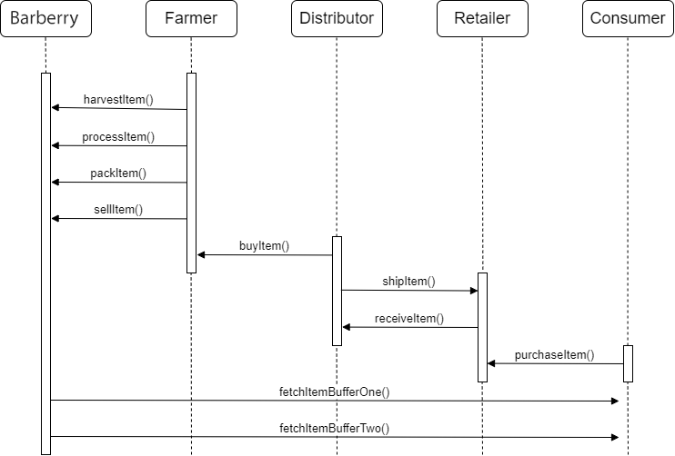
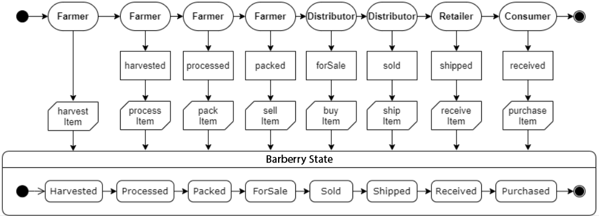
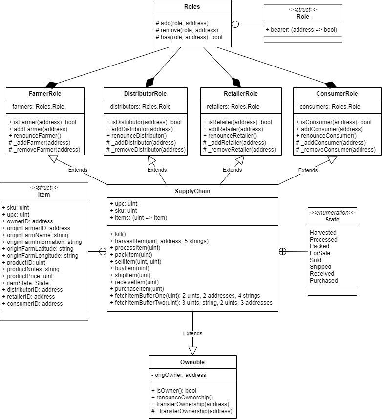

# Blockchain Supply Chain Dapp

This is a decentralized blockchain based supply chain solution. Access control enabled smart contract to manage specific user permission controls Tracks and verifies a product’s authenticity and facilitate the traceability of a product. Demonstrates various stages a  product goes through till it reaches the consumer. We will build an application using the Ethereum blockchain for storage of data and smart contract functionality .

### Story:

Barberry is an evergreen shrub with thorny stems that grow up to 4 meters in height. The wood of this tree is brown, red or yellow. The leaves are oval and toothed. The branches in barberry bushes have many razors, they bloom in spring and autumn is the harvest season for its fruits. The flowers of barberry are yellow and the fruit of barberry is oval, red and juicy. The fruit of wild barberry has seeds but barberries that are planted in Iranian farms have a seedless fruit that is very valuable and rare.There is the largest seedless barberry farm in the world in the village of Afin.
Afin village is located in South Khorasan, a legendary land in eastern Iran from which twenty-two thousand tons of barberry are harvested annually and the occupation of all villagers is agriculture in barberry fields.Barberry roots, leaves, stems and fruits are used in food and pharmaceutical industries.
One of the traditional and delicious Iranian dishes is called barberry pilaf. The red fruits of roasted barberry along with the white grains of Iranian rice and of course a little yellow saffron have created a beautiful painting.
95% of the world's barberry is produced in the legendary land of South Khorasan province in eastern Iran. Barberry red bushes along with the historical monuments of South Khorasan province have created amazing landscapes.

### Afin Barberry Farm 


This repository containts an Ethereum DApp that demonstrates a Supply Chain flow between a farmer and consumer for the barberry crop. The user story is similar to any commonly used supply chain process.

Product: Barberry

Actors: Farmer, Distributor, Retailer, Consumer

States: Harvested, Processed, Packed, ForSale, Sold, Shipped, Received, Purchased  


## UML Diagrams

For this project, we have the following UML diagrams:


### Activity Diagram



### Sequence Diagram



### State Diagram



### Classes Diagram




## Getting Started

These instructions will get you a copy of the project up and running on your local machine for development and testing purposes. See deployment for notes on how to deploy the project on a live system.

### Prerequisites

Please make sure you've already installed ganache-cli, Truffle and enabled MetaMask extension in your browser.

### Installing

After cloning the repository, change directory to ```project-6``` folder and install all requisite npm packages (as listed in ```package.json```):

```
cd project-6
npm install
```

Launch Ganache(the chainId used here was 1337):

```
ganache-cli --deterministic -i 1337 --chainId 1337 "spirit supply whale amount human item harsh scare congress discover talent hamster"
```

Then, in a separate terminal window, you can ```compile, migrate and test``` the smart contracts.

In a separate terminal window, launch the DApp:

```
npm run dev
```


## Transaction ID / Contract Address in Rinkeby
For SupplyChain contract we have:

- Transaction ID: 0x03a0255ea99bb4f26d43c507aebe2de59e93b7df2caa555d114aa2fee96b40b2
- Contract address: 0x8Ed08581FE8a8E2DACe06D84b1854927573Dc193

You can check in etherscan with the link: https://rinkeby.etherscan.io/address/0x8Ed08581FE8a8E2DACe06D84b1854927573Dc193
